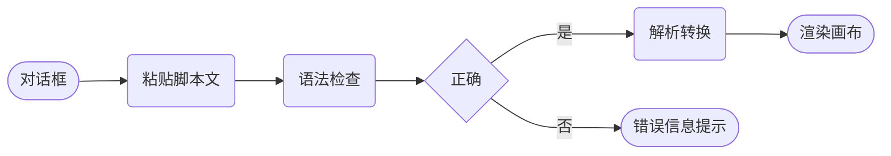
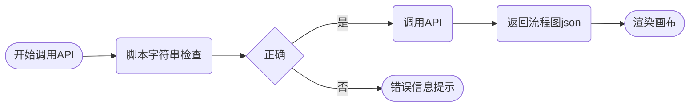

# 一. 功能目标

将Mermaid中flowchart类型的流程图转换为vueflow的流程图

# 二. 具体要求

1. 将Mermaid中flowchart流程图脚本导入本系统后，转换为本系统的流程图

2. 只转换flowchart类型的，如不是，则在检验时提示错误信息：非flowchart类型

## 1. 解析的内容

### 1.1 流程图标题

忽略脚本中的title标签。

例如：

```
---
title: Node with text
---
```

### 1.2 流程图方向

仅支持以下三种

1. flowchart TB

2. flowchart TD

3. flowchart LR

### 1.3 节点的处理

#### 节点类型转换映射

除以下五种Mermaid节点类型外，其它类型忽略转换

| Mermaid节点类型                  | Mermaid脚本语法示例                         | 本系统节点类型                                  |
| ---------------------------- | ------------------------------------- | ---------------------------------------- |
| defult                       | id或id1[This is the text in the box]   | src\components\Nodes\RoundedRectNode.vue |
| round edges                  | id1(This is the text in the box)      | src\components\Nodes\RoundedRectNode.vue |
| stadium-shaped node          | id1([This is the text in the box])    | src\components\Nodes\StartEndNode.vue    |
| node in the form of a circle | id1((This is the text in the circle)) | src\components\Nodes\CircleNode.vue      |
| rhombus                      | id1{This is the text in the box}      | src\components\Nodes\ConditionNode.vue   |

#### 节点ID的处理

Mermaid中节点ID转换映射为本系统相应节点的ID，ID必须唯一，如重复，则视为检验校验的错误，抛出错误提示。

#### 节点文本的处理

1. Mermaid中节点文本，如id[text]、id("text")内的text，解析为本系统组件的label的text

2. - HTML标签： 不考虑转义，转义符直接移除。
   
   - 换行符： 可以直接移除
   
   - 标签（不支持HTML渲染）。
   
   - 特殊字符和转义符直接移除。

3. 不支持节点文本多行显示

#### 节点的分组处理

节点分组处理忽略

#### 节点样式的处理

1. 忽略节点所有边框样式

2. 忽略节点背景色

3. 忽略节点内文本样式

4. 使用本系统默认的节点边框样式、背景色、文本样式

### 1.4 子图subgraph的解析

忽略所有子图节眯及连线

### 1.5 连线的处理

连线解析为本vueflow默认的连线组件，解析内容包括：

#### 1.5.1 连线的类型转换

| Mermaid连线 | 形态1   | 形态2    | 形态3     | 映射本系统CSS样式    |
| --------- | ----- | ------ | ------- | ------------- |
| 普通的       | `---` | `----` | `-----` | 线型：实线(solid)  |
| 厚的        | `===` | `====` | `=====` | 线型：实线、粗细：2px  |
| 点状        | `-.-` | `-..-` | `-...-` | 线型：点线（dotted） |

#### 连线的ID处理

mermaid的连线ID忽略不处理

#### 连线标签的位置

连线的标签位置映射到本系统连组件label的默认位置

- 只保留第一个标签。

- 标签长度最多16个字符，多余的截掉

#### 复合线的处理

忽略复合线语法解析

#### 连线的长度处理

忽略连线长度

#### 连线的标签内容

Mermaid脚本语法如：A-- text -->B、A-->|text|B

#### 连线的样式处理

Mermaid连线的颜色映射到本系统连线组件的颜色属性

忽略连线的动画属性

#### 连线的箭头处理

Mermaid连线箭头统一映射为本系统默认的箭头

## 2. 忽略解析的内容

1. 未明确的节点类型直接忽略

2. 连线的颜色、粗细

3. 连线的动画

4. 连线的类型

5. 连线的箭头类型

6. Mermaid配置文件

## 3. 导入的方式

### 3.1 手动导入



1. 在src\components\Toolbar\CanvasTools.vue组件上增加一个图标按纽，点击后弹出对话框，在对话框的文本框内粘贴Mermaid脚本代码，限制在200行以内，大于200行时，在文本框下方提示错误：”脚本超过200行不能解析“。

2. 按确认按纽后检查粘贴内容格式是否正式的合法性检查，如错误如解析错误，在粘贴内容的文本框下面红字提示用户：“数据格式不正确”。

3. 检查脚本无错误后，按确认按纽，关闭对话框，完成转换，在画布上渲染转换为本系统组件的流程图，不需要预览。

4. 内容验证规则见3.3.1

### 3.2 API调用



1. 使用更规范的方式定义WEBAPI接口，包括请求方法为POST、请求参数、请求体、响应格式、响应状态码、错误码等
   
   在src\components\FlowEditor.vue组件和src\components\FlowViewer.vue上都增加相同的功能API，调用时传入一个txt文件格式字符串。
   
   - API的请求方法是POST
   
   - API的请求参数：txt文件字符串
   
   - API的返回格式：本系统流程图的json文件，状态码、错误信息
   
   - API的错误处理机制？
   
   - API的安全性考虑授权token

2. 在调用API前脚本字符串做合法性检查，如有错误，返回错误信息终止调用，弹窗提示用户检查的错误信息，信息内容为3.3.1。

3. 如正确则调用API，返回本系统流程图的josn文件，并在画布上渲染出来。

4. 如调用API失败，则弹窗提示API调用错误（如网络错误、服务器错误），信息内容为3.3.3。

5. 如调用成功后渲染错误，则弹窗提示数据错误，信息内容为3.3.2

### 3.3 合法性检查及错误信息内容

1. Mermaid脚本解析错误（如语法错误、不支持的节点类型、ID重复等）或非flowchart类型数据。

2. 节点/连线转换错误（如无法映射的样式）。

3. API调用错误（如网络错误、服务器错误）。

# 三. 不考虑的因素

1. 不需要对节点和连线的数量进行限制

2. 不考虑Mermaid脚本复杂带来的渲染性能影响

3. 不考虑支持更多Mermaid特性

# 四. 参考转换示例

## Mermaid脚本

```
---
title: 忽略标题
---

flowchart LR

    A([开始调用API])
    C(脚本字符串检查)
    style C fill:#f9f,stroke:#333,stroke-width:4px
    D{正确}
    B(调用API):::someclass
    classDef someclass fill:#f96
    E(返回流程图json)
    F([<span>渲染画布</span>])
    G([错误信息提示])
    H((弹窗))
    FA[/忽略非指定的转换类型/]
    Thr@{shape: docs, label: "忽略非指定的转型类型"}
    J["`是否**flowchart**类型
    存在*其它类型*节点 `"]
    I["`忽略转义符 char:#9829;
    忽略HTML标识<br>
    忽略连线ID及动画
    忽略节点边框样式及背景色`"]

    A -->C
    C e1@-->D
    D --是--->B
    B -->E
    D --否--->G
    E -->F
    H -->G
    C -.->J
    I -.->E
    e1@{ animate: true }
```

## 本系统vueflow的转换json

```{
{
  "nodes": [
    {
      "id": "startEnd-1",
      "type": "startEnd",
      "dimensions": {
        "width": 100,
        "height": 38
      },
      "computedPosition": {
        "x": 111,
        "y": 181,
        "z": 0
      },
      "handleBounds": {
        "source": [
          {
            "id": "right-handle",
            "position": "right",
            "nodeId": "startEnd-1",
            "type": "source",
            "x": 95,
            "y": 15,
            "width": 8,
            "height": 8
          },
          {
            "id": "bottom-handle",
            "position": "bottom",
            "nodeId": "startEnd-1",
            "type": "source",
            "x": 46,
            "y": 33,
            "width": 8,
            "height": 8
          }
        ],
        "target": [
          {
            "id": "left-handle",
            "position": "left",
            "nodeId": "startEnd-1",
            "type": "target",
            "x": -3,
            "y": 15,
            "width": 8,
            "height": 8
          },
          {
            "id": "top-handle",
            "position": "top",
            "nodeId": "startEnd-1",
            "type": "target",
            "x": 46,
            "y": -3,
            "width": 8,
            "height": 8
          }
        ]
      },
      "selected": false,
      "dragging": false,
      "resizing": false,
      "initialized": false,
      "isParent": false,
      "position": {
        "x": 111,
        "y": 181
      },
      "data": {
        "label": "开始调用API",
        "style": {
          "width": "100px",
          "height": "38px",
          "textAlign": "center",
          "fontWeight": "normal",
          "fontStyle": "normal",
          "textDecoration": "none"
        },
        "isEditing": false,
        "fontSize": 14,
        "color": "#000000"
      },
      "events": {},
      "style": {
        "width": "100px",
        "height": "38px"
      },
      "width": 100,
      "height": 38
    },
    {
      "id": "roundedRect-2",
      "type": "roundedRect",
      "dimensions": {
        "width": 100,
        "height": 38
      },
      "computedPosition": {
        "x": 281,
        "y": 181,
        "z": 0
      },
      "handleBounds": {
        "source": [
          {
            "id": "right-handle",
            "position": "right",
            "nodeId": "roundedRect-2",
            "type": "source",
            "x": 95,
            "y": 15,
            "width": 8,
            "height": 8
          },
          {
            "id": "bottom-handle",
            "position": "bottom",
            "nodeId": "roundedRect-2",
            "type": "source",
            "x": 46,
            "y": 33,
            "width": 8,
            "height": 8
          }
        ],
        "target": [
          {
            "id": "left-handle",
            "position": "left",
            "nodeId": "roundedRect-2",
            "type": "target",
            "x": -3,
            "y": 15,
            "width": 8,
            "height": 8
          },
          {
            "id": "top-handle",
            "position": "top",
            "nodeId": "roundedRect-2",
            "type": "target",
            "x": 46,
            "y": -3,
            "width": 8,
            "height": 8
          }
        ]
      },
      "selected": false,
      "dragging": false,
      "resizing": false,
      "initialized": false,
      "isParent": false,
      "position": {
        "x": 281,
        "y": 181
      },
      "data": {
        "label": "脚本字符串检查",
        "style": {
          "width": "100px",
          "height": "38px",
          "textAlign": "center",
          "fontWeight": "normal",
          "fontStyle": "normal",
          "textDecoration": "none"
        },
        "isEditing": false,
        "fontSize": 14,
        "color": "#000000"
      },
      "events": {},
      "style": {
        "width": "100px",
        "height": "38px"
      },
      "width": 100,
      "height": 38
    },
    {
      "id": "condition-3",
      "type": "condition",
      "dimensions": {
        "width": 100,
        "height": 60
      },
      "computedPosition": {
        "x": 449,
        "y": 170,
        "z": 0
      },
      "handleBounds": {
        "source": [
          {
            "id": "right-handle",
            "position": "right",
            "nodeId": "condition-3",
            "type": "source",
            "x": 96,
            "y": 26,
            "width": 8,
            "height": 8
          },
          {
            "id": "bottom-handle",
            "position": "bottom",
            "nodeId": "condition-3",
            "type": "source",
            "x": 46,
            "y": 56,
            "width": 8,
            "height": 8
          }
        ],
        "target": [
          {
            "id": "left-handle",
            "position": "left",
            "nodeId": "condition-3",
            "type": "target",
            "x": -4,
            "y": 26,
            "width": 8,
            "height": 8
          },
          {
            "id": "top-handle",
            "position": "top",
            "nodeId": "condition-3",
            "type": "target",
            "x": 46,
            "y": -4,
            "width": 8,
            "height": 8
          }
        ]
      },
      "selected": false,
      "dragging": false,
      "resizing": false,
      "initialized": false,
      "isParent": false,
      "position": {
        "x": 449,
        "y": 170
      },
      "data": {
        "label": "正确",
        "style": {
          "width": "100px",
          "height": "60px",
          "textAlign": "center",
          "fontWeight": "normal",
          "fontStyle": "normal",
          "textDecoration": "none",
          "backgroundColor": "#ffffff",
          "borderWidth": 1,
          "borderColor": "#555",
          "borderStyle": "solid"
        },
        "isEditing": false,
        "fontSize": 14,
        "color": "#000000"
      },
      "events": {},
      "style": {
        "width": "100px",
        "height": "60px"
      },
      "width": 100,
      "height": 60
    },
    {
      "id": "roundedRect-4",
      "type": "roundedRect",
      "dimensions": {
        "width": 100,
        "height": 38
      },
      "computedPosition": {
        "x": 611,
        "y": 181,
        "z": 0
      },
      "handleBounds": {
        "source": [
          {
            "id": "right-handle",
            "position": "right",
            "nodeId": "roundedRect-4",
            "type": "source",
            "x": 95,
            "y": 15,
            "width": 8,
            "height": 8
          },
          {
            "id": "bottom-handle",
            "position": "bottom",
            "nodeId": "roundedRect-4",
            "type": "source",
            "x": 46,
            "y": 33,
            "width": 8,
            "height": 8
          }
        ],
        "target": [
          {
            "id": "left-handle",
            "position": "left",
            "nodeId": "roundedRect-4",
            "type": "target",
            "x": -3,
            "y": 15,
            "width": 8,
            "height": 8
          },
          {
            "id": "top-handle",
            "position": "top",
            "nodeId": "roundedRect-4",
            "type": "target",
            "x": 46,
            "y": -3,
            "width": 8,
            "height": 8
          }
        ]
      },
      "selected": false,
      "dragging": false,
      "resizing": false,
      "initialized": false,
      "isParent": false,
      "position": {
        "x": 611,
        "y": 181
      },
      "data": {
        "label": "调用API",
        "style": {
          "width": "100px",
          "height": "38px",
          "textAlign": "center",
          "fontWeight": "normal",
          "fontStyle": "normal",
          "textDecoration": "none"
        },
        "isEditing": false,
        "fontSize": 14,
        "color": "#000000"
      },
      "events": {},
      "style": {
        "width": "100px",
        "height": "38px"
      },
      "width": 100,
      "height": 38
    },
    {
      "id": "startEnd-5",
      "type": "startEnd",
      "dimensions": {
        "width": 100,
        "height": 38
      },
      "computedPosition": {
        "x": 611,
        "y": 293,
        "z": 0
      },
      "handleBounds": {
        "source": [
          {
            "id": "right-handle",
            "position": "right",
            "nodeId": "startEnd-5",
            "type": "source",
            "x": 95,
            "y": 15,
            "width": 8,
            "height": 8
          },
          {
            "id": "bottom-handle",
            "position": "bottom",
            "nodeId": "startEnd-5",
            "type": "source",
            "x": 46,
            "y": 33,
            "width": 8,
            "height": 8
          }
        ],
        "target": [
          {
            "id": "left-handle",
            "position": "left",
            "nodeId": "startEnd-5",
            "type": "target",
            "x": -3,
            "y": 15,
            "width": 8,
            "height": 8
          },
          {
            "id": "top-handle",
            "position": "top",
            "nodeId": "startEnd-5",
            "type": "target",
            "x": 46,
            "y": -3,
            "width": 8,
            "height": 8
          }
        ]
      },
      "selected": false,
      "dragging": false,
      "resizing": false,
      "initialized": false,
      "isParent": false,
      "position": {
        "x": 611,
        "y": 293
      },
      "data": {
        "label": "错误信息提示",
        "style": {
          "width": "100px",
          "height": "38px",
          "textAlign": "center",
          "fontWeight": "normal",
          "fontStyle": "normal",
          "textDecoration": "none"
        },
        "isEditing": false,
        "fontSize": 14,
        "color": "#000000"
      },
      "events": {},
      "style": {
        "width": "100px",
        "height": "38px"
      },
      "width": 100,
      "height": 38
    },
    {
      "id": "circle-6",
      "type": "circle",
      "dimensions": {
        "width": 38,
        "height": 38
      },
      "computedPosition": {
        "x": 810,
        "y": 293,
        "z": 0
      },
      "handleBounds": {
        "source": [
          {
            "id": "right-handle",
            "position": "right",
            "nodeId": "circle-6",
            "type": "source",
            "x": 34,
            "y": 15,
            "width": 8,
            "height": 8
          },
          {
            "id": "bottom-handle",
            "position": "bottom",
            "nodeId": "circle-6",
            "type": "source",
            "x": 15,
            "y": 34,
            "width": 8,
            "height": 8
          }
        ],
        "target": [
          {
            "id": "left-handle",
            "position": "left",
            "nodeId": "circle-6",
            "type": "target",
            "x": -4,
            "y": 15,
            "width": 8,
            "height": 8
          },
          {
            "id": "top-handle",
            "position": "top",
            "nodeId": "circle-6",
            "type": "target",
            "x": 15,
            "y": -4,
            "width": 8,
            "height": 8
          }
        ]
      },
      "selected": false,
      "dragging": false,
      "resizing": false,
      "initialized": false,
      "isParent": false,
      "position": {
        "x": 810,
        "y": 293
      },
      "data": {
        "label": "弹窗",
        "style": {
          "width": "38px",
          "height": "38px",
          "textAlign": "center",
          "fontWeight": "normal",
          "fontStyle": "normal",
          "textDecoration": "none",
          "backgroundColor": "#ffffff",
          "borderWidth": 1,
          "borderColor": "#000000",
          "borderStyle": "solid"
        },
        "isEditing": false,
        "fontSize": 14,
        "color": "#000000"
      },
      "events": {},
      "width": 38,
      "height": 38
    },
    {
      "id": "roundedRect-7",
      "type": "roundedRect",
      "dimensions": {
        "width": 100,
        "height": 38
      },
      "computedPosition": {
        "x": 779,
        "y": 181,
        "z": 0
      },
      "handleBounds": {
        "source": [
          {
            "id": "right-handle",
            "position": "right",
            "nodeId": "roundedRect-7",
            "type": "source",
            "x": 95,
            "y": 15,
            "width": 8,
            "height": 8
          },
          {
            "id": "bottom-handle",
            "position": "bottom",
            "nodeId": "roundedRect-7",
            "type": "source",
            "x": 46,
            "y": 33,
            "width": 8,
            "height": 8
          }
        ],
        "target": [
          {
            "id": "left-handle",
            "position": "left",
            "nodeId": "roundedRect-7",
            "type": "target",
            "x": -3,
            "y": 15,
            "width": 8,
            "height": 8
          },
          {
            "id": "top-handle",
            "position": "top",
            "nodeId": "roundedRect-7",
            "type": "target",
            "x": 46,
            "y": -3,
            "width": 8,
            "height": 8
          }
        ]
      },
      "selected": false,
      "dragging": false,
      "resizing": false,
      "initialized": false,
      "isParent": false,
      "position": {
        "x": 779,
        "y": 181
      },
      "data": {
        "label": "返回流程图json",
        "style": {
          "width": "100px",
          "height": "38px",
          "textAlign": "center",
          "fontWeight": "normal",
          "fontStyle": "normal",
          "textDecoration": "none"
        },
        "isEditing": false,
        "fontSize": 14,
        "color": "#000000"
      },
      "events": {},
      "style": {
        "width": "100px",
        "height": "38px"
      },
      "width": 100,
      "height": 38
    },
    {
      "id": "startEnd-1742910666044-ix75qcw82",
      "type": "startEnd",
      "dimensions": {
        "width": 100,
        "height": 38
      },
      "computedPosition": {
        "x": 945,
        "y": 181,
        "z": 0
      },
      "handleBounds": {
        "source": [
          {
            "id": "right-handle",
            "position": "right",
            "nodeId": "startEnd-1742910666044-ix75qcw82",
            "type": "source",
            "x": 95,
            "y": 15,
            "width": 8,
            "height": 8
          },
          {
            "id": "bottom-handle",
            "position": "bottom",
            "nodeId": "startEnd-1742910666044-ix75qcw82",
            "type": "source",
            "x": 46,
            "y": 33,
            "width": 8,
            "height": 8
          }
        ],
        "target": [
          {
            "id": "left-handle",
            "position": "left",
            "nodeId": "startEnd-1742910666044-ix75qcw82",
            "type": "target",
            "x": -3,
            "y": 15,
            "width": 8,
            "height": 8
          },
          {
            "id": "top-handle",
            "position": "top",
            "nodeId": "startEnd-1742910666044-ix75qcw82",
            "type": "target",
            "x": 46,
            "y": -3,
            "width": 8,
            "height": 8
          }
        ]
      },
      "draggable": true,
      "selectable": true,
      "connectable": true,
      "selected": false,
      "dragging": false,
      "resizing": false,
      "initialized": false,
      "isParent": false,
      "position": {
        "x": 945,
        "y": 181
      },
      "data": {
        "label": "渲染画布",
        "style": {
          "width": "100px",
          "height": "38px",
          "textAlign": "center",
          "fontWeight": "normal",
          "fontStyle": "normal",
          "textDecoration": "none"
        },
        "isEditing": false,
        "draggable": true,
        "selectable": true,
        "connectable": true,
        "fontSize": 14,
        "color": "#000000"
      },
      "events": {},
      "style": {
        "width": "100px",
        "height": "38px"
      },
      "width": 100,
      "height": 38
    },
    {
      "id": "roundedRect-9",
      "type": "roundedRect",
      "dimensions": {
        "width": 100,
        "height": 38
      },
      "computedPosition": {
        "x": 281,
        "y": 328,
        "z": 0
      },
      "handleBounds": {
        "source": [
          {
            "id": "right-handle",
            "position": "right",
            "nodeId": "roundedRect-9",
            "type": "source",
            "x": 95,
            "y": 15,
            "width": 8,
            "height": 8
          },
          {
            "id": "bottom-handle",
            "position": "bottom",
            "nodeId": "roundedRect-9",
            "type": "source",
            "x": 46,
            "y": 33,
            "width": 8,
            "height": 8
          }
        ],
        "target": [
          {
            "id": "left-handle",
            "position": "left",
            "nodeId": "roundedRect-9",
            "type": "target",
            "x": -3,
            "y": 15,
            "width": 8,
            "height": 8
          },
          {
            "id": "top-handle",
            "position": "top",
            "nodeId": "roundedRect-9",
            "type": "target",
            "x": 46,
            "y": -3,
            "width": 8,
            "height": 8
          }
        ]
      },
      "selected": false,
      "dragging": false,
      "resizing": false,
      "initialized": false,
      "isParent": false,
      "position": {
        "x": 281,
        "y": 328
      },
      "data": {
        "label": "是否flowchar类型存在其它类型节点",
        "style": {
          "width": "100px",
          "height": "38px",
          "textAlign": "center",
          "fontWeight": "normal",
          "fontStyle": "normal",
          "textDecoration": "none",
          "borderWidth": 1
        },
        "isEditing": false,
        "fontSize": 14,
        "color": "#000000"
      },
      "events": {},
      "style": {
        "width": "100px",
        "height": "38px"
      },
      "width": 100,
      "height": 38
    },
    {
      "id": "roundedRect-10",
      "type": "roundedRect",
      "dimensions": {
        "width": 134,
        "height": 72
      },
      "computedPosition": {
        "x": 762,
        "y": 42,
        "z": 0
      },
      "handleBounds": {
        "source": [
          {
            "id": "right-handle",
            "position": "right",
            "nodeId": "roundedRect-10",
            "type": "source",
            "x": 129,
            "y": 32,
            "width": 8,
            "height": 8
          },
          {
            "id": "bottom-handle",
            "position": "bottom",
            "nodeId": "roundedRect-10",
            "type": "source",
            "x": 63,
            "y": 67,
            "width": 8,
            "height": 8
          }
        ],
        "target": [
          {
            "id": "left-handle",
            "position": "left",
            "nodeId": "roundedRect-10",
            "type": "target",
            "x": -3,
            "y": 32,
            "width": 8,
            "height": 8
          },
          {
            "id": "top-handle",
            "position": "top",
            "nodeId": "roundedRect-10",
            "type": "target",
            "x": 63,
            "y": -3,
            "width": 8,
            "height": 8
          }
        ]
      },
      "selected": false,
      "dragging": false,
      "resizing": false,
      "initialized": false,
      "isParent": false,
      "position": {
        "x": 762,
        "y": 42
      },
      "data": {
        "label": "忽略转义符 char:忽略HTML标识忽略连线ID及动画忽略节点边框样式及背景色",
        "style": {
          "width": "134px",
          "height": "72px",
          "textAlign": "center",
          "fontWeight": "normal",
          "fontStyle": "normal",
          "textDecoration": "none",
          "borderWidth": 1
        },
        "isEditing": false,
        "fontSize": 14,
        "color": "#000000"
      },
      "events": {},
      "style": {
        "width": "134px",
        "height": "72px"
      },
      "width": 134,
      "height": 72
    }
  ],
  "edges": [
    {
      "id": "estartEnd-1-roundedRect-2",
      "type": "smoothstep",
      "source": "startEnd-1",
      "target": "roundedRect-2",
      "sourceHandle": "right-handle",
      "targetHandle": "left-handle",
      "data": {
        "savedLineWidth": 1,
        "savedLineColor": "#555555",
        "savedLineStyle": "solid",
        "savedArrowStyle": "target",
        "label": ""
      },
      "events": {},
      "label": "",
      "style": {
        "strokeWidth": 1,
        "stroke": "#555555"
      },
      "markerEnd": {
        "type": "arrow",
        "color": "#555555",
        "width": 15,
        "height": 15,
        "strokeWidth": 2
      },
      "sourceNode": {
        "id": "startEnd-1",
        "type": "startEnd",
        "dimensions": {
          "width": 100,
          "height": 38
        },
        "computedPosition": {
          "x": 111,
          "y": 181,
          "z": 0
        },
        "handleBounds": {
          "source": [
            {
              "id": "right-handle",
              "position": "right",
              "nodeId": "startEnd-1",
              "type": "source",
              "x": 95,
              "y": 15,
              "width": 8,
              "height": 8
            },
            {
              "id": "bottom-handle",
              "position": "bottom",
              "nodeId": "startEnd-1",
              "type": "source",
              "x": 46,
              "y": 33,
              "width": 8,
              "height": 8
            }
          ],
          "target": [
            {
              "id": "left-handle",
              "position": "left",
              "nodeId": "startEnd-1",
              "type": "target",
              "x": -3,
              "y": 15,
              "width": 8,
              "height": 8
            },
            {
              "id": "top-handle",
              "position": "top",
              "nodeId": "startEnd-1",
              "type": "target",
              "x": 46,
              "y": -3,
              "width": 8,
              "height": 8
            }
          ]
        },
        "selected": false,
        "dragging": false,
        "resizing": false,
        "initialized": false,
        "isParent": false,
        "position": {
          "x": 111,
          "y": 181
        },
        "data": {
          "label": "开始调用API",
          "style": {
            "width": "100px",
            "height": "38px",
            "textAlign": "center",
            "fontWeight": "normal",
            "fontStyle": "normal",
            "textDecoration": "none"
          },
          "isEditing": false,
          "fontSize": 14,
          "color": "#000000"
        },
        "events": {},
        "style": {
          "width": "100px",
          "height": "38px"
        },
        "width": 100,
        "height": 38
      },
      "targetNode": {
        "id": "roundedRect-2",
        "type": "roundedRect",
        "dimensions": {
          "width": 100,
          "height": 38
        },
        "computedPosition": {
          "x": 281,
          "y": 181,
          "z": 0
        },
        "handleBounds": {
          "source": [
            {
              "id": "right-handle",
              "position": "right",
              "nodeId": "roundedRect-2",
              "type": "source",
              "x": 95,
              "y": 15,
              "width": 8,
              "height": 8
            },
            {
              "id": "bottom-handle",
              "position": "bottom",
              "nodeId": "roundedRect-2",
              "type": "source",
              "x": 46,
              "y": 33,
              "width": 8,
              "height": 8
            }
          ],
          "target": [
            {
              "id": "left-handle",
              "position": "left",
              "nodeId": "roundedRect-2",
              "type": "target",
              "x": -3,
              "y": 15,
              "width": 8,
              "height": 8
            },
            {
              "id": "top-handle",
              "position": "top",
              "nodeId": "roundedRect-2",
              "type": "target",
              "x": 46,
              "y": -3,
              "width": 8,
              "height": 8
            }
          ]
        },
        "selected": false,
        "dragging": false,
        "resizing": false,
        "initialized": false,
        "isParent": false,
        "position": {
          "x": 281,
          "y": 181
        },
        "data": {
          "label": "脚本字符串检查",
          "style": {
            "width": "100px",
            "height": "38px",
            "textAlign": "center",
            "fontWeight": "normal",
            "fontStyle": "normal",
            "textDecoration": "none"
          },
          "isEditing": false,
          "fontSize": 14,
          "color": "#000000"
        },
        "events": {},
        "style": {
          "width": "100px",
          "height": "38px"
        },
        "width": 100,
        "height": 38
      },
      "sourceX": 214,
      "sourceY": 200,
      "targetX": 278,
      "targetY": 200,
      "selected": false
    },
    {
      "id": "eroundedRect-2-condition-3",
      "type": "smoothstep",
      "source": "roundedRect-2",
      "target": "condition-3",
      "sourceHandle": "right-handle",
      "targetHandle": "left-handle",
      "data": {
        "savedLineWidth": 1,
        "savedLineColor": "#555555",
        "savedLineStyle": "solid",
        "savedArrowStyle": "target",
        "label": ""
      },
      "events": {},
      "label": "",
      "style": {
        "strokeWidth": 1,
        "stroke": "#555555"
      },
      "markerEnd": {
        "type": "arrow",
        "color": "#555555",
        "width": 15,
        "height": 15,
        "strokeWidth": 2
      },
      "sourceNode": {
        "id": "roundedRect-2",
        "type": "roundedRect",
        "dimensions": {
          "width": 100,
          "height": 38
        },
        "computedPosition": {
          "x": 281,
          "y": 181,
          "z": 0
        },
        "handleBounds": {
          "source": [
            {
              "id": "right-handle",
              "position": "right",
              "nodeId": "roundedRect-2",
              "type": "source",
              "x": 95,
              "y": 15,
              "width": 8,
              "height": 8
            },
            {
              "id": "bottom-handle",
              "position": "bottom",
              "nodeId": "roundedRect-2",
              "type": "source",
              "x": 46,
              "y": 33,
              "width": 8,
              "height": 8
            }
          ],
          "target": [
            {
              "id": "left-handle",
              "position": "left",
              "nodeId": "roundedRect-2",
              "type": "target",
              "x": -3,
              "y": 15,
              "width": 8,
              "height": 8
            },
            {
              "id": "top-handle",
              "position": "top",
              "nodeId": "roundedRect-2",
              "type": "target",
              "x": 46,
              "y": -3,
              "width": 8,
              "height": 8
            }
          ]
        },
        "selected": false,
        "dragging": false,
        "resizing": false,
        "initialized": false,
        "isParent": false,
        "position": {
          "x": 281,
          "y": 181
        },
        "data": {
          "label": "脚本字符串检查",
          "style": {
            "width": "100px",
            "height": "38px",
            "textAlign": "center",
            "fontWeight": "normal",
            "fontStyle": "normal",
            "textDecoration": "none"
          },
          "isEditing": false,
          "fontSize": 14,
          "color": "#000000"
        },
        "events": {},
        "style": {
          "width": "100px",
          "height": "38px"
        },
        "width": 100,
        "height": 38
      },
      "targetNode": {
        "id": "condition-3",
        "type": "condition",
        "dimensions": {
          "width": 100,
          "height": 60
        },
        "computedPosition": {
          "x": 449,
          "y": 170,
          "z": 0
        },
        "handleBounds": {
          "source": [
            {
              "id": "right-handle",
              "position": "right",
              "nodeId": "condition-3",
              "type": "source",
              "x": 96,
              "y": 26,
              "width": 8,
              "height": 8
            },
            {
              "id": "bottom-handle",
              "position": "bottom",
              "nodeId": "condition-3",
              "type": "source",
              "x": 46,
              "y": 56,
              "width": 8,
              "height": 8
            }
          ],
          "target": [
            {
              "id": "left-handle",
              "position": "left",
              "nodeId": "condition-3",
              "type": "target",
              "x": -4,
              "y": 26,
              "width": 8,
              "height": 8
            },
            {
              "id": "top-handle",
              "position": "top",
              "nodeId": "condition-3",
              "type": "target",
              "x": 46,
              "y": -4,
              "width": 8,
              "height": 8
            }
          ]
        },
        "selected": false,
        "dragging": false,
        "resizing": false,
        "initialized": false,
        "isParent": false,
        "position": {
          "x": 449,
          "y": 170
        },
        "data": {
          "label": "正确",
          "style": {
            "width": "100px",
            "height": "60px",
            "textAlign": "center",
            "fontWeight": "normal",
            "fontStyle": "normal",
            "textDecoration": "none",
            "backgroundColor": "#ffffff",
            "borderWidth": 1,
            "borderColor": "#555",
            "borderStyle": "solid"
          },
          "isEditing": false,
          "fontSize": 14,
          "color": "#000000"
        },
        "events": {},
        "style": {
          "width": "100px",
          "height": "60px"
        },
        "width": 100,
        "height": 60
      },
      "sourceX": 384,
      "sourceY": 200,
      "targetX": 445,
      "targetY": 200,
      "selected": false
    },
    {
      "id": "econdition-3-roundedRect-4",
      "type": "smoothstep",
      "source": "condition-3",
      "target": "roundedRect-4",
      "sourceHandle": "right-handle",
      "targetHandle": "left-handle",
      "data": {
        "savedLineWidth": 1,
        "savedLineColor": "#555555",
        "savedLineStyle": "solid",
        "savedArrowStyle": "target",
        "label": "是"
      },
      "events": {},
      "label": "是",
      "style": {
        "strokeWidth": 1,
        "stroke": "#555555"
      },
      "markerEnd": {
        "type": "arrow",
        "color": "#555555",
        "width": 15,
        "height": 15,
        "strokeWidth": 2
      },
      "sourceNode": {
        "id": "condition-3",
        "type": "condition",
        "dimensions": {
          "width": 100,
          "height": 60
        },
        "computedPosition": {
          "x": 449,
          "y": 170,
          "z": 0
        },
        "handleBounds": {
          "source": [
            {
              "id": "right-handle",
              "position": "right",
              "nodeId": "condition-3",
              "type": "source",
              "x": 96,
              "y": 26,
              "width": 8,
              "height": 8
            },
            {
              "id": "bottom-handle",
              "position": "bottom",
              "nodeId": "condition-3",
              "type": "source",
              "x": 46,
              "y": 56,
              "width": 8,
              "height": 8
            }
          ],
          "target": [
            {
              "id": "left-handle",
              "position": "left",
              "nodeId": "condition-3",
              "type": "target",
              "x": -4,
              "y": 26,
              "width": 8,
              "height": 8
            },
            {
              "id": "top-handle",
              "position": "top",
              "nodeId": "condition-3",
              "type": "target",
              "x": 46,
              "y": -4,
              "width": 8,
              "height": 8
            }
          ]
        },
        "selected": false,
        "dragging": false,
        "resizing": false,
        "initialized": false,
        "isParent": false,
        "position": {
          "x": 449,
          "y": 170
        },
        "data": {
          "label": "正确",
          "style": {
            "width": "100px",
            "height": "60px",
            "textAlign": "center",
            "fontWeight": "normal",
            "fontStyle": "normal",
            "textDecoration": "none",
            "backgroundColor": "#ffffff",
            "borderWidth": 1,
            "borderColor": "#555",
            "borderStyle": "solid"
          },
          "isEditing": false,
          "fontSize": 14,
          "color": "#000000"
        },
        "events": {},
        "style": {
          "width": "100px",
          "height": "60px"
        },
        "width": 100,
        "height": 60
      },
      "targetNode": {
        "id": "roundedRect-4",
        "type": "roundedRect",
        "dimensions": {
          "width": 100,
          "height": 38
        },
        "computedPosition": {
          "x": 611,
          "y": 181,
          "z": 0
        },
        "handleBounds": {
          "source": [
            {
              "id": "right-handle",
              "position": "right",
              "nodeId": "roundedRect-4",
              "type": "source",
              "x": 95,
              "y": 15,
              "width": 8,
              "height": 8
            },
            {
              "id": "bottom-handle",
              "position": "bottom",
              "nodeId": "roundedRect-4",
              "type": "source",
              "x": 46,
              "y": 33,
              "width": 8,
              "height": 8
            }
          ],
          "target": [
            {
              "id": "left-handle",
              "position": "left",
              "nodeId": "roundedRect-4",
              "type": "target",
              "x": -3,
              "y": 15,
              "width": 8,
              "height": 8
            },
            {
              "id": "top-handle",
              "position": "top",
              "nodeId": "roundedRect-4",
              "type": "target",
              "x": 46,
              "y": -3,
              "width": 8,
              "height": 8
            }
          ]
        },
        "selected": false,
        "dragging": false,
        "resizing": false,
        "initialized": false,
        "isParent": false,
        "position": {
          "x": 611,
          "y": 181
        },
        "data": {
          "label": "调用API",
          "style": {
            "width": "100px",
            "height": "38px",
            "textAlign": "center",
            "fontWeight": "normal",
            "fontStyle": "normal",
            "textDecoration": "none"
          },
          "isEditing": false,
          "fontSize": 14,
          "color": "#000000"
        },
        "events": {},
        "style": {
          "width": "100px",
          "height": "38px"
        },
        "width": 100,
        "height": 38
      },
      "sourceX": 553,
      "sourceY": 200,
      "targetX": 608,
      "targetY": 200,
      "selected": false
    },
    {
      "id": "econdition-3-startEnd-5",
      "type": "smoothstep",
      "source": "condition-3",
      "target": "startEnd-5",
      "sourceHandle": "bottom-handle",
      "targetHandle": "left-handle",
      "data": {
        "savedLineWidth": 1,
        "savedLineColor": "#555555",
        "savedLineStyle": "solid",
        "savedArrowStyle": "target",
        "label": "否"
      },
      "events": {},
      "label": "否",
      "style": {
        "strokeWidth": 1,
        "stroke": "#555555"
      },
      "markerEnd": {
        "type": "arrow",
        "color": "#555555",
        "width": 15,
        "height": 15,
        "strokeWidth": 2
      },
      "sourceNode": {
        "id": "condition-3",
        "type": "condition",
        "dimensions": {
          "width": 100,
          "height": 60
        },
        "computedPosition": {
          "x": 449,
          "y": 170,
          "z": 0
        },
        "handleBounds": {
          "source": [
            {
              "id": "right-handle",
              "position": "right",
              "nodeId": "condition-3",
              "type": "source",
              "x": 96,
              "y": 26,
              "width": 8,
              "height": 8
            },
            {
              "id": "bottom-handle",
              "position": "bottom",
              "nodeId": "condition-3",
              "type": "source",
              "x": 46,
              "y": 56,
              "width": 8,
              "height": 8
            }
          ],
          "target": [
            {
              "id": "left-handle",
              "position": "left",
              "nodeId": "condition-3",
              "type": "target",
              "x": -4,
              "y": 26,
              "width": 8,
              "height": 8
            },
            {
              "id": "top-handle",
              "position": "top",
              "nodeId": "condition-3",
              "type": "target",
              "x": 46,
              "y": -4,
              "width": 8,
              "height": 8
            }
          ]
        },
        "selected": false,
        "dragging": false,
        "resizing": false,
        "initialized": false,
        "isParent": false,
        "position": {
          "x": 449,
          "y": 170
        },
        "data": {
          "label": "正确",
          "style": {
            "width": "100px",
            "height": "60px",
            "textAlign": "center",
            "fontWeight": "normal",
            "fontStyle": "normal",
            "textDecoration": "none",
            "backgroundColor": "#ffffff",
            "borderWidth": 1,
            "borderColor": "#555",
            "borderStyle": "solid"
          },
          "isEditing": false,
          "fontSize": 14,
          "color": "#000000"
        },
        "events": {},
        "style": {
          "width": "100px",
          "height": "60px"
        },
        "width": 100,
        "height": 60
      },
      "targetNode": {
        "id": "startEnd-5",
        "type": "startEnd",
        "dimensions": {
          "width": 100,
          "height": 38
        },
        "computedPosition": {
          "x": 611,
          "y": 293,
          "z": 0
        },
        "handleBounds": {
          "source": [
            {
              "id": "right-handle",
              "position": "right",
              "nodeId": "startEnd-5",
              "type": "source",
              "x": 95,
              "y": 15,
              "width": 8,
              "height": 8
            },
            {
              "id": "bottom-handle",
              "position": "bottom",
              "nodeId": "startEnd-5",
              "type": "source",
              "x": 46,
              "y": 33,
              "width": 8,
              "height": 8
            }
          ],
          "target": [
            {
              "id": "left-handle",
              "position": "left",
              "nodeId": "startEnd-5",
              "type": "target",
              "x": -3,
              "y": 15,
              "width": 8,
              "height": 8
            },
            {
              "id": "top-handle",
              "position": "top",
              "nodeId": "startEnd-5",
              "type": "target",
              "x": 46,
              "y": -3,
              "width": 8,
              "height": 8
            }
          ]
        },
        "selected": false,
        "dragging": false,
        "resizing": false,
        "initialized": false,
        "isParent": false,
        "position": {
          "x": 611,
          "y": 293
        },
        "data": {
          "label": "错误信息提示",
          "style": {
            "width": "100px",
            "height": "38px",
            "textAlign": "center",
            "fontWeight": "normal",
            "fontStyle": "normal",
            "textDecoration": "none"
          },
          "isEditing": false,
          "fontSize": 14,
          "color": "#000000"
        },
        "events": {},
        "style": {
          "width": "100px",
          "height": "38px"
        },
        "width": 100,
        "height": 38
      },
      "sourceX": 499,
      "sourceY": 234,
      "targetX": 608,
      "targetY": 312,
      "selected": false
    },
    {
      "id": "estartEnd-5-circle-6",
      "type": "smoothstep",
      "source": "startEnd-5",
      "target": "circle-6",
      "sourceHandle": "right-handle",
      "targetHandle": "left-handle",
      "data": {
        "savedLineWidth": 1,
        "savedLineColor": "#555555",
        "savedLineStyle": "solid",
        "savedArrowStyle": "source",
        "label": ""
      },
      "events": {},
      "label": "",
      "style": {
        "strokeWidth": 1,
        "stroke": "#555555"
      },
      "sourceNode": {
        "id": "startEnd-5",
        "type": "startEnd",
        "dimensions": {
          "width": 100,
          "height": 38
        },
        "computedPosition": {
          "x": 611,
          "y": 293,
          "z": 0
        },
        "handleBounds": {
          "source": [
            {
              "id": "right-handle",
              "position": "right",
              "nodeId": "startEnd-5",
              "type": "source",
              "x": 95,
              "y": 15,
              "width": 8,
              "height": 8
            },
            {
              "id": "bottom-handle",
              "position": "bottom",
              "nodeId": "startEnd-5",
              "type": "source",
              "x": 46,
              "y": 33,
              "width": 8,
              "height": 8
            }
          ],
          "target": [
            {
              "id": "left-handle",
              "position": "left",
              "nodeId": "startEnd-5",
              "type": "target",
              "x": -3,
              "y": 15,
              "width": 8,
              "height": 8
            },
            {
              "id": "top-handle",
              "position": "top",
              "nodeId": "startEnd-5",
              "type": "target",
              "x": 46,
              "y": -3,
              "width": 8,
              "height": 8
            }
          ]
        },
        "selected": false,
        "dragging": false,
        "resizing": false,
        "initialized": false,
        "isParent": false,
        "position": {
          "x": 611,
          "y": 293
        },
        "data": {
          "label": "错误信息提示",
          "style": {
            "width": "100px",
            "height": "38px",
            "textAlign": "center",
            "fontWeight": "normal",
            "fontStyle": "normal",
            "textDecoration": "none"
          },
          "isEditing": false,
          "fontSize": 14,
          "color": "#000000"
        },
        "events": {},
        "style": {
          "width": "100px",
          "height": "38px"
        },
        "width": 100,
        "height": 38
      },
      "targetNode": {
        "id": "circle-6",
        "type": "circle",
        "dimensions": {
          "width": 38,
          "height": 38
        },
        "computedPosition": {
          "x": 810,
          "y": 293,
          "z": 0
        },
        "handleBounds": {
          "source": [
            {
              "id": "right-handle",
              "position": "right",
              "nodeId": "circle-6",
              "type": "source",
              "x": 34,
              "y": 15,
              "width": 8,
              "height": 8
            },
            {
              "id": "bottom-handle",
              "position": "bottom",
              "nodeId": "circle-6",
              "type": "source",
              "x": 15,
              "y": 34,
              "width": 8,
              "height": 8
            }
          ],
          "target": [
            {
              "id": "left-handle",
              "position": "left",
              "nodeId": "circle-6",
              "type": "target",
              "x": -4,
              "y": 15,
              "width": 8,
              "height": 8
            },
            {
              "id": "top-handle",
              "position": "top",
              "nodeId": "circle-6",
              "type": "target",
              "x": 15,
              "y": -4,
              "width": 8,
              "height": 8
            }
          ]
        },
        "selected": false,
        "dragging": false,
        "resizing": false,
        "initialized": false,
        "isParent": false,
        "position": {
          "x": 810,
          "y": 293
        },
        "data": {
          "label": "弹窗",
          "style": {
            "width": "38px",
            "height": "38px",
            "textAlign": "center",
            "fontWeight": "normal",
            "fontStyle": "normal",
            "textDecoration": "none",
            "backgroundColor": "#ffffff",
            "borderWidth": 1,
            "borderColor": "#000000",
            "borderStyle": "solid"
          },
          "isEditing": false,
          "fontSize": 14,
          "color": "#000000"
        },
        "events": {},
        "width": 38,
        "height": 38
      },
      "sourceX": 714,
      "sourceY": 312,
      "targetX": 806,
      "targetY": 312,
      "selected": false,
      "markerStart": {
        "type": "arrow",
        "color": "#555555",
        "width": 15,
        "height": 15,
        "strokeWidth": 2
      }
    },
    {
      "id": "eroundedRect-4-roundedRect-7",
      "type": "smoothstep",
      "source": "roundedRect-4",
      "target": "roundedRect-7",
      "sourceHandle": "right-handle",
      "targetHandle": "left-handle",
      "data": {
        "savedLineWidth": 1,
        "savedLineColor": "#555555",
        "savedLineStyle": "solid",
        "savedArrowStyle": "target",
        "label": ""
      },
      "events": {},
      "label": "",
      "style": {
        "strokeWidth": 1,
        "stroke": "#555555"
      },
      "markerEnd": {
        "type": "arrow",
        "color": "#555555",
        "width": 15,
        "height": 15,
        "strokeWidth": 2
      },
      "sourceNode": {
        "id": "roundedRect-4",
        "type": "roundedRect",
        "dimensions": {
          "width": 100,
          "height": 38
        },
        "computedPosition": {
          "x": 611,
          "y": 181,
          "z": 0
        },
        "handleBounds": {
          "source": [
            {
              "id": "right-handle",
              "position": "right",
              "nodeId": "roundedRect-4",
              "type": "source",
              "x": 95,
              "y": 15,
              "width": 8,
              "height": 8
            },
            {
              "id": "bottom-handle",
              "position": "bottom",
              "nodeId": "roundedRect-4",
              "type": "source",
              "x": 46,
              "y": 33,
              "width": 8,
              "height": 8
            }
          ],
          "target": [
            {
              "id": "left-handle",
              "position": "left",
              "nodeId": "roundedRect-4",
              "type": "target",
              "x": -3,
              "y": 15,
              "width": 8,
              "height": 8
            },
            {
              "id": "top-handle",
              "position": "top",
              "nodeId": "roundedRect-4",
              "type": "target",
              "x": 46,
              "y": -3,
              "width": 8,
              "height": 8
            }
          ]
        },
        "selected": false,
        "dragging": false,
        "resizing": false,
        "initialized": false,
        "isParent": false,
        "position": {
          "x": 611,
          "y": 181
        },
        "data": {
          "label": "调用API",
          "style": {
            "width": "100px",
            "height": "38px",
            "textAlign": "center",
            "fontWeight": "normal",
            "fontStyle": "normal",
            "textDecoration": "none"
          },
          "isEditing": false,
          "fontSize": 14,
          "color": "#000000"
        },
        "events": {},
        "style": {
          "width": "100px",
          "height": "38px"
        },
        "width": 100,
        "height": 38
      },
      "targetNode": {
        "id": "roundedRect-7",
        "type": "roundedRect",
        "dimensions": {
          "width": 100,
          "height": 38
        },
        "computedPosition": {
          "x": 779,
          "y": 181,
          "z": 0
        },
        "handleBounds": {
          "source": [
            {
              "id": "right-handle",
              "position": "right",
              "nodeId": "roundedRect-7",
              "type": "source",
              "x": 95,
              "y": 15,
              "width": 8,
              "height": 8
            },
            {
              "id": "bottom-handle",
              "position": "bottom",
              "nodeId": "roundedRect-7",
              "type": "source",
              "x": 46,
              "y": 33,
              "width": 8,
              "height": 8
            }
          ],
          "target": [
            {
              "id": "left-handle",
              "position": "left",
              "nodeId": "roundedRect-7",
              "type": "target",
              "x": -3,
              "y": 15,
              "width": 8,
              "height": 8
            },
            {
              "id": "top-handle",
              "position": "top",
              "nodeId": "roundedRect-7",
              "type": "target",
              "x": 46,
              "y": -3,
              "width": 8,
              "height": 8
            }
          ]
        },
        "selected": false,
        "dragging": false,
        "resizing": false,
        "initialized": false,
        "isParent": false,
        "position": {
          "x": 779,
          "y": 181
        },
        "data": {
          "label": "返回流程图json",
          "style": {
            "width": "100px",
            "height": "38px",
            "textAlign": "center",
            "fontWeight": "normal",
            "fontStyle": "normal",
            "textDecoration": "none"
          },
          "isEditing": false,
          "fontSize": 14,
          "color": "#000000"
        },
        "events": {},
        "style": {
          "width": "100px",
          "height": "38px"
        },
        "width": 100,
        "height": 38
      },
      "sourceX": 714,
      "sourceY": 200,
      "targetX": 776,
      "targetY": 200,
      "selected": false
    },
    {
      "id": "eroundedRect-7-startEnd-1742910666044-ix75qcw82",
      "type": "smoothstep",
      "source": "roundedRect-7",
      "target": "startEnd-1742910666044-ix75qcw82",
      "sourceHandle": "right-handle",
      "targetHandle": "left-handle",
      "data": {
        "savedLineWidth": 1,
        "savedLineColor": "#555555",
        "savedLineStyle": "solid",
        "savedArrowStyle": "target",
        "label": ""
      },
      "events": {},
      "label": "",
      "style": {
        "strokeWidth": 1,
        "stroke": "#555555"
      },
      "markerEnd": {
        "type": "arrow",
        "color": "#555555",
        "width": 15,
        "height": 15,
        "strokeWidth": 2
      },
      "sourceNode": {
        "id": "roundedRect-7",
        "type": "roundedRect",
        "dimensions": {
          "width": 100,
          "height": 38
        },
        "computedPosition": {
          "x": 779,
          "y": 181,
          "z": 0
        },
        "handleBounds": {
          "source": [
            {
              "id": "right-handle",
              "position": "right",
              "nodeId": "roundedRect-7",
              "type": "source",
              "x": 95,
              "y": 15,
              "width": 8,
              "height": 8
            },
            {
              "id": "bottom-handle",
              "position": "bottom",
              "nodeId": "roundedRect-7",
              "type": "source",
              "x": 46,
              "y": 33,
              "width": 8,
              "height": 8
            }
          ],
          "target": [
            {
              "id": "left-handle",
              "position": "left",
              "nodeId": "roundedRect-7",
              "type": "target",
              "x": -3,
              "y": 15,
              "width": 8,
              "height": 8
            },
            {
              "id": "top-handle",
              "position": "top",
              "nodeId": "roundedRect-7",
              "type": "target",
              "x": 46,
              "y": -3,
              "width": 8,
              "height": 8
            }
          ]
        },
        "selected": false,
        "dragging": false,
        "resizing": false,
        "initialized": false,
        "isParent": false,
        "position": {
          "x": 779,
          "y": 181
        },
        "data": {
          "label": "返回流程图json",
          "style": {
            "width": "100px",
            "height": "38px",
            "textAlign": "center",
            "fontWeight": "normal",
            "fontStyle": "normal",
            "textDecoration": "none"
          },
          "isEditing": false,
          "fontSize": 14,
          "color": "#000000"
        },
        "events": {},
        "style": {
          "width": "100px",
          "height": "38px"
        },
        "width": 100,
        "height": 38
      },
      "targetNode": {
        "id": "startEnd-1742910666044-ix75qcw82",
        "type": "startEnd",
        "dimensions": {
          "width": 100,
          "height": 38
        },
        "computedPosition": {
          "x": 945,
          "y": 181,
          "z": 0
        },
        "handleBounds": {
          "source": [
            {
              "id": "right-handle",
              "position": "right",
              "nodeId": "startEnd-1742910666044-ix75qcw82",
              "type": "source",
              "x": 95,
              "y": 15,
              "width": 8,
              "height": 8
            },
            {
              "id": "bottom-handle",
              "position": "bottom",
              "nodeId": "startEnd-1742910666044-ix75qcw82",
              "type": "source",
              "x": 46,
              "y": 33,
              "width": 8,
              "height": 8
            }
          ],
          "target": [
            {
              "id": "left-handle",
              "position": "left",
              "nodeId": "startEnd-1742910666044-ix75qcw82",
              "type": "target",
              "x": -3,
              "y": 15,
              "width": 8,
              "height": 8
            },
            {
              "id": "top-handle",
              "position": "top",
              "nodeId": "startEnd-1742910666044-ix75qcw82",
              "type": "target",
              "x": 46,
              "y": -3,
              "width": 8,
              "height": 8
            }
          ]
        },
        "draggable": true,
        "selectable": true,
        "connectable": true,
        "selected": false,
        "dragging": false,
        "resizing": false,
        "initialized": false,
        "isParent": false,
        "position": {
          "x": 945,
          "y": 181
        },
        "data": {
          "label": "渲染画布",
          "style": {
            "width": "100px",
            "height": "38px",
            "textAlign": "center",
            "fontWeight": "normal",
            "fontStyle": "normal",
            "textDecoration": "none"
          },
          "isEditing": false,
          "draggable": true,
          "selectable": true,
          "connectable": true,
          "fontSize": 14,
          "color": "#000000"
        },
        "events": {},
        "style": {
          "width": "100px",
          "height": "38px"
        },
        "width": 100,
        "height": 38
      },
      "sourceX": 882,
      "sourceY": 200,
      "targetX": 942,
      "targetY": 200,
      "selected": false
    },
    {
      "id": "eroundedRect-2-roundedRect-9",
      "type": "smoothstep",
      "source": "roundedRect-2",
      "target": "roundedRect-9",
      "sourceHandle": "bottom-handle",
      "targetHandle": "top-handle",
      "data": {
        "savedLineWidth": 1,
        "savedLineColor": "#555555",
        "savedLineStyle": "dotted",
        "savedArrowStyle": "target",
        "label": ""
      },
      "events": {},
      "label": "",
      "style": {
        "strokeWidth": 1,
        "stroke": "#555555",
        "strokeDasharray": "2 2"
      },
      "markerEnd": {
        "type": "arrow",
        "color": "#555555",
        "width": 15,
        "height": 15,
        "strokeWidth": 2
      },
      "sourceNode": {
        "id": "roundedRect-2",
        "type": "roundedRect",
        "dimensions": {
          "width": 100,
          "height": 38
        },
        "computedPosition": {
          "x": 281,
          "y": 181,
          "z": 0
        },
        "handleBounds": {
          "source": [
            {
              "id": "right-handle",
              "position": "right",
              "nodeId": "roundedRect-2",
              "type": "source",
              "x": 95,
              "y": 15,
              "width": 8,
              "height": 8
            },
            {
              "id": "bottom-handle",
              "position": "bottom",
              "nodeId": "roundedRect-2",
              "type": "source",
              "x": 46,
              "y": 33,
              "width": 8,
              "height": 8
            }
          ],
          "target": [
            {
              "id": "left-handle",
              "position": "left",
              "nodeId": "roundedRect-2",
              "type": "target",
              "x": -3,
              "y": 15,
              "width": 8,
              "height": 8
            },
            {
              "id": "top-handle",
              "position": "top",
              "nodeId": "roundedRect-2",
              "type": "target",
              "x": 46,
              "y": -3,
              "width": 8,
              "height": 8
            }
          ]
        },
        "selected": false,
        "dragging": false,
        "resizing": false,
        "initialized": false,
        "isParent": false,
        "position": {
          "x": 281,
          "y": 181
        },
        "data": {
          "label": "脚本字符串检查",
          "style": {
            "width": "100px",
            "height": "38px",
            "textAlign": "center",
            "fontWeight": "normal",
            "fontStyle": "normal",
            "textDecoration": "none"
          },
          "isEditing": false,
          "fontSize": 14,
          "color": "#000000"
        },
        "events": {},
        "style": {
          "width": "100px",
          "height": "38px"
        },
        "width": 100,
        "height": 38
      },
      "targetNode": {
        "id": "roundedRect-9",
        "type": "roundedRect",
        "dimensions": {
          "width": 100,
          "height": 38
        },
        "computedPosition": {
          "x": 281,
          "y": 328,
          "z": 0
        },
        "handleBounds": {
          "source": [
            {
              "id": "right-handle",
              "position": "right",
              "nodeId": "roundedRect-9",
              "type": "source",
              "x": 95,
              "y": 15,
              "width": 8,
              "height": 8
            },
            {
              "id": "bottom-handle",
              "position": "bottom",
              "nodeId": "roundedRect-9",
              "type": "source",
              "x": 46,
              "y": 33,
              "width": 8,
              "height": 8
            }
          ],
          "target": [
            {
              "id": "left-handle",
              "position": "left",
              "nodeId": "roundedRect-9",
              "type": "target",
              "x": -3,
              "y": 15,
              "width": 8,
              "height": 8
            },
            {
              "id": "top-handle",
              "position": "top",
              "nodeId": "roundedRect-9",
              "type": "target",
              "x": 46,
              "y": -3,
              "width": 8,
              "height": 8
            }
          ]
        },
        "selected": false,
        "dragging": false,
        "resizing": false,
        "initialized": false,
        "isParent": false,
        "position": {
          "x": 281,
          "y": 328
        },
        "data": {
          "label": "是否flowchar类型存在其它类型节点",
          "style": {
            "width": "100px",
            "height": "38px",
            "textAlign": "center",
            "fontWeight": "normal",
            "fontStyle": "normal",
            "textDecoration": "none",
            "borderWidth": 1
          },
          "isEditing": false
        },
        "events": {},
        "style": {
          "width": "100px",
          "height": "38px"
        }
      },
      "sourceX": 331,
      "sourceY": 222,
      "targetX": 331,
      "targetY": 325,
      "selected": false
    },
    {
      "id": "eroundedRect-10-roundedRect-7",
      "type": "smoothstep",
      "source": "roundedRect-10",
      "target": "roundedRect-7",
      "sourceHandle": "bottom-handle",
      "targetHandle": "top-handle",
      "data": {
        "savedLineWidth": 1,
        "savedLineColor": "#555555",
        "savedLineStyle": "dotted",
        "savedArrowStyle": "target",
        "label": ""
      },
      "events": {},
      "label": "",
      "style": {
        "strokeWidth": 1,
        "stroke": "#555555",
        "strokeDasharray": "2 2"
      },
      "markerEnd": {
        "type": "arrow",
        "color": "#555555",
        "width": 15,
        "height": 15,
        "strokeWidth": 2
      },
      "sourceNode": {
        "id": "roundedRect-10",
        "type": "roundedRect",
        "dimensions": {
          "width": 134,
          "height": 72
        },
        "computedPosition": {
          "x": 762,
          "y": 42,
          "z": 0
        },
        "handleBounds": {
          "source": [
            {
              "id": "right-handle",
              "position": "right",
              "nodeId": "roundedRect-10",
              "type": "source",
              "x": 129,
              "y": 32,
              "width": 8,
              "height": 8
            },
            {
              "id": "bottom-handle",
              "position": "bottom",
              "nodeId": "roundedRect-10",
              "type": "source",
              "x": 63,
              "y": 67,
              "width": 8,
              "height": 8
            }
          ],
          "target": [
            {
              "id": "left-handle",
              "position": "left",
              "nodeId": "roundedRect-10",
              "type": "target",
              "x": -3,
              "y": 32,
              "width": 8,
              "height": 8
            },
            {
              "id": "top-handle",
              "position": "top",
              "nodeId": "roundedRect-10",
              "type": "target",
              "x": 63,
              "y": -3,
              "width": 8,
              "height": 8
            }
          ]
        },
        "selected": false,
        "dragging": false,
        "resizing": false,
        "initialized": false,
        "isParent": false,
        "position": {
          "x": 762,
          "y": 42
        },
        "data": {
          "label": "忽略转义符 char:忽略HTML标识忽略连线ID及动画忽略节点边框样式及背景色",
          "style": {
            "width": "134px",
            "height": "72px",
            "textAlign": "center",
            "fontWeight": "normal",
            "fontStyle": "normal",
            "textDecoration": "none",
            "borderWidth": 1
          },
          "isEditing": false
        },
        "events": {},
        "style": {
          "width": "134px",
          "height": "72px"
        }
      },
      "targetNode": {
        "id": "roundedRect-7",
        "type": "roundedRect",
        "dimensions": {
          "width": 100,
          "height": 38
        },
        "computedPosition": {
          "x": 779,
          "y": 181,
          "z": 0
        },
        "handleBounds": {
          "source": [
            {
              "id": "right-handle",
              "position": "right",
              "nodeId": "roundedRect-7",
              "type": "source",
              "x": 95,
              "y": 15,
              "width": 8,
              "height": 8
            },
            {
              "id": "bottom-handle",
              "position": "bottom",
              "nodeId": "roundedRect-7",
              "type": "source",
              "x": 46,
              "y": 33,
              "width": 8,
              "height": 8
            }
          ],
          "target": [
            {
              "id": "left-handle",
              "position": "left",
              "nodeId": "roundedRect-7",
              "type": "target",
              "x": -3,
              "y": 15,
              "width": 8,
              "height": 8
            },
            {
              "id": "top-handle",
              "position": "top",
              "nodeId": "roundedRect-7",
              "type": "target",
              "x": 46,
              "y": -3,
              "width": 8,
              "height": 8
            }
          ]
        },
        "selected": false,
        "dragging": false,
        "resizing": false,
        "initialized": false,
        "isParent": false,
        "position": {
          "x": 779,
          "y": 181
        },
        "data": {
          "label": "返回流程图json",
          "style": {
            "width": "100px",
            "height": "38px",
            "textAlign": "center",
            "fontWeight": "normal",
            "fontStyle": "normal",
            "textDecoration": "none"
          },
          "isEditing": false,
          "fontSize": 14,
          "color": "#000000"
        },
        "events": {},
        "style": {
          "width": "100px",
          "height": "38px"
        },
        "width": 100,
        "height": 38
      },
      "sourceX": 829,
      "sourceY": 117,
      "targetX": 829,
      "targetY": 178,
      "selected": false
    }
  ]
}
```
