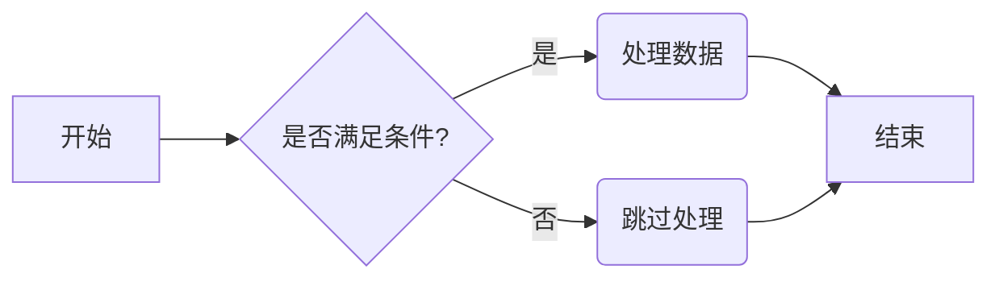
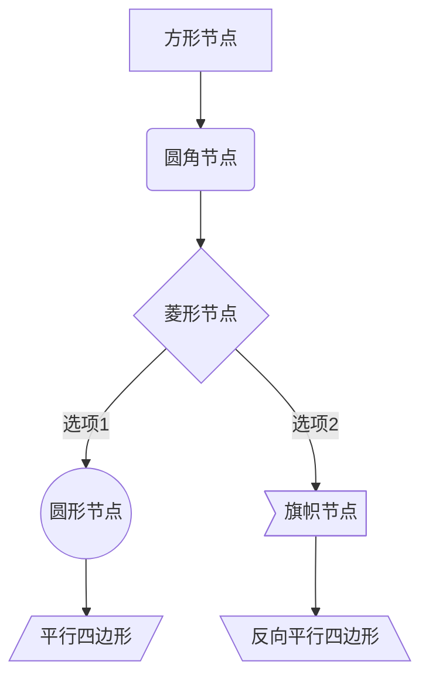
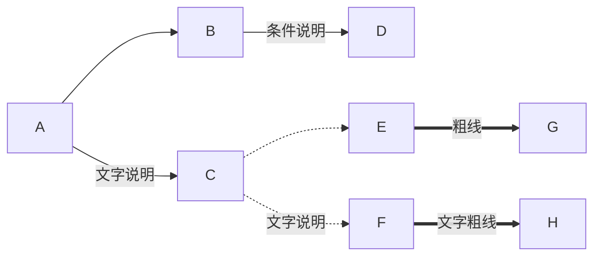

# Mermaid导入功能测试指南

本测试指南帮助您验证MuFlow应用中的Mermaid流程图导入功能是否正常工作。

## 测试步骤

1. **准备测试数据**：使用以下Mermaid流程图脚本示例
2. **打开MuFlow应用**：确保应用已启动并正常运行
3. **访问Mermaid导入功能**：点击顶部工具栏中的Mermaid导入按钮
4. **粘贴测试脚本**：将示例脚本粘贴到Mermaid导入对话框中
5. **执行导入**：点击"导入"按钮
6. **验证结果**：检查流程图是否正确显示

## 测试脚本示例

### 基础流程图

### 多种节点类型示例

### 复杂连线示例

## 预期结果

1. **节点转换**：Mermaid中的不同节点类型应被正确转换为MuFlow中对应的节点类型
2. **连线转换**：连线样式和文字标签应正确显示
3. **布局转换**：整体布局应与原Mermaid流程图保持相似

## 故障排除

如果导入过程中遇到问题，请检查：

1. **脚本语法**：确保Mermaid脚本语法正确无误
2. **浏览器控制台**：查看浏览器开发者工具中的控制台是否有错误信息
3. **功能限制**：确认您的脚本不包含目前不支持的功能（如子图）

## 报告问题

如测试过程中发现任何问题，请通过以下方式报告：

1. 在GitHub仓库中提交Issue
2. 描述问题现象和复现步骤
3. 附上您使用的Mermaid脚本
4. 如可能，提供截图或录屏 